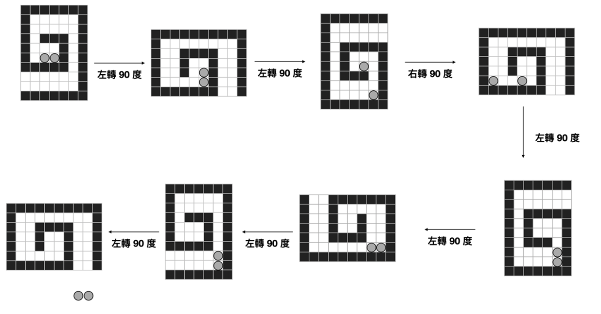

# 迷宮鑰匙圈 (Maze)

## 問題描述

小咪到夜市玩遊戲，贏得了一副鑰匙圈。這副鑰匙圈上有個迷宮面板，裡面有好幾顆小鋼珠：

\begin{figure}[!htb]
  \centering
  \includegraphics[width=0.5\linewidth]{maze1.jpg}
  \caption{圖片來源：FB 粉絲專頁「小藍貓 :3」(BlueCatFriends)}
\end{figure}

\noindent 將鑰匙圈的面板向左或向右旋轉 $90$ 度，可以使每顆仍在迷宮內的小鋼珠向下掉落，直到該小鋼珠掉出迷宮，碰到迷宮擋板，或碰到其他仍在迷宮內的小鋼珠為止。更明確地說，這座迷宮可以用 $N\times M$ 的二維矩陣表示，一次的 $90$ 度旋轉會將迷宮變換為 $M\times N$ 的二維矩陣，其中

* 一次 $90$ 度左旋轉會將位置 $(i, j)$ 變換成位置 $(M-j+1, i)$。
* 一次 $90$ 度右旋轉會將位置 $(i, j)$ 變換成位置 $(j, N-i+1)$。

\noindent 此外，若旋轉後位置 $(i, j)$ 有一顆小鋼珠，則

* 若存在某個 $i' > i$ 滿足 $(i', j)$ 為迷宮擋板，則
   1. 設最小的 $i'$ 為 $i^*$。
   1. 若 $(i, j), (i+1, j), \ldots, (i^*-1, j)$ 間恰有 $k$ 顆小鋼珠，則原位置 $(i, j)$ 的小鋼珠會掉到位置 $(i^*-k, j)$。
* 否則，該小鋼珠將掉出迷宮。

給定迷宮與小鋼珠的起始位置，請算出至少需要向左或向右旋轉 $90$ 度幾次，才能使每顆小鋼珠都掉出迷宮。

以下是一個迷宮大小為 $10\times7$ 的例子：

## 輸入格式

\begin{format}
\f{
$n$ $m$
$s_{1, 1}$ $s_{1, 2}$ $\ldots$ $s_{1, m}$
$s_{2, 1}$ $s_{2, 2}$ $\ldots$ $s_{2, m}$
$\vdots$
$s_{n, 1}$ $s_{n, 2}$ $\ldots$ $s_{n, m}$
}
\end{format}

* $n$ 代表迷宮的列數。
* $m$ 代表迷宮的行數。
* $s_{i, j}$ 代表位置 $(i, j)$ 的狀態，以字元 ``b``、``s``、``w`` 表示，其中
  1. ``b`` 代表該格為空且有小鋼珠。
  1. ``s`` 代表該格為空且沒有小鋼珠。
  1. ``w`` 代表該格為迷宮擋板。

## 輸出格式

如果存在使每顆小鋼珠都掉出迷宮的旋轉方式，請輸出

\begin{format}
\f{
$\textrm{ans}$
}
\end{format}

\noindent 其中 $\textrm{ans}$ 為一整數，代表所需的旋轉次數。否則，請輸出

\begin{format}
\f{
$-1$
}
\end{format}

## 測資限制

* $1 \le n \le 15$。
* $1 \le m \le 15$。
* 對任意 $i \in \{1, 2, \ldots, n\}$ 與 $j \in \{1, 2, \ldots, m\}$，$s_{i, j}$ 只能是 ``b``、``s``、或 ``w``。
* 滿足 $s_{i, j}$ 為 ``b`` 的 $(i, j)$ 對數介於 $1$ 與 $3$ 之間。
* 給定的迷宮保證不會有不穩定的狀態，亦即若 $s_{i, j}$ 為 ``b``，則必定存在某個 $i^* > i$ 滿足
  1. $s_{i^*, j}$ 為 ``w``。
  1. $s_{i, j}, s_{i+1, j}, \ldots, s_{i^*-1, j}$ 均為 ``b``。
* $n$ 與 $m$ 皆為整數。

## 範例測試

## 評分說明

本題共有三組子任務，條件限制如下所示。
每一組可有一或多筆測試資料，該組所有測試資料皆需答對才會獲得該組分數。

|  子任務  |  分數  | 額外輸入限制 |
| :------: | :----: | ------------ |
| 1 | {{score.subtask1}} | 迷宮裡的小鋼珠數量為 $1$ |
| 2 | {{score.subtask2}} | 迷宮裡的小鋼珠數量不超過 $2$ |
| 3 | {{score.subtask3}} | 無額外限制 |
